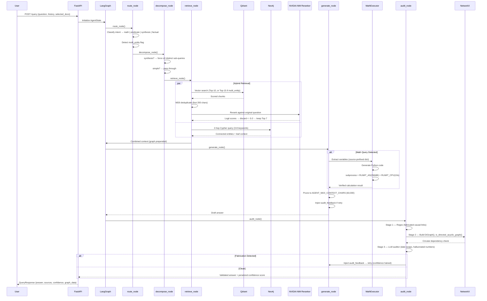

<div align="center">

# 🧠 DocuMind AI

### Hybrid RAG + Knowledge Graph Intelligence for Complex Document Reasoning

*A production-grade, multi-agent pipeline featuring dual-model orchestration,*  
*OS-level math sandboxing, and strict constraint verification — deployed on Kubernetes.*

<br/>

[](https://python.org)
[](https://fastapi.tiangolo.com)
[](https://react.dev)
[](https://langchain-ai.github.io/langgraph)

[](https://build.nvidia.com)
[](https://qdrant.tech)
[](https://neo4j.com)
[](https://min.io)

[](https://kubernetes.io)
[](https://docs.celeryq.dev)
[](https://redis.io)
[](https://github.com/features/actions)

<br/>

[🎯 Overview](#-overview) • [🏗️ Architecture](#️-architecture) • [🧠 AI Pipeline](#-the-ai-pipeline) • [🧮 Math Sandbox](#-math-execution--os-level-sandboxing) • [📊 Confidence Scoring](#-confidence-scoring--penalties) • [🛠️ Stack](#️-technology-stack) • [🚢 Deployment](#-kubernetes-deployment) • [🧪 Evaluation](#-evaluation)

</div>

---

## 🎯 Overview

DocuMind AI is a **hallucination-resistant document intelligence platform** built for financial and technical documents. It fuses **4096-dimensional dense vector retrieval** with **knowledge graph topology**, brokered by a LangGraph state machine.

Traditional RAG fails at math, breaks on conflicting evidence, and hallucinates causality. DocuMind solves all three:

<br/>

<table>
<tr>
<td width="33%">

**🔬 Hybrid Retrieval**  
Qdrant 4096-dim vector search fused with 2-hop Neo4j graph traversal. NVIDIA NIM reranker filters to the Top 7 most relevant chunks.

</td>
<td width="33%">

**🧮 Sandboxed Math**  
Intercepts quantitative queries and executes LLM-generated Python with OS-level `RLIMIT_AS` (256MB) and `RLIMIT_CPU` (10s) resource caps.

</td>
<td width="33%">

**🛡️ 3-Stage Audit**  
Every answer passes regex → NetworkX circular dependency → LLM fabrication detection before reaching the user.

</td>
</tr>
<tr>
<td>

**🧬 Dual-Model Design**  
A primary reasoning LLM and a separate structured extraction LLM (Qwen 2.5 Coder) work in parallel — one generates, one validates.

</td>
<td>

**🔗 RapidFuzz Coreference**  
Entities deduplicated via `token_sort_ratio`. Matches >85% auto-merged; ambiguous clusters (60–84%) escalated to the LLM.

</td>
<td>

**📊 Penalized Confidence**  
Scores aren't raw probabilities. They are mathematically penalized based on contradictions found and audit retries required.

</td>
</tr>
</table>

---

## 🏗️ Architecture

### The 7 Core Services

```
┌─────────────────────────────────────────────────────────────────┐
│                        Kubernetes Cluster                        │
│                                                                  │
│  ┌──────────────┐    ┌──────────────┐    ┌──────────────────┐   │
│  │   React 19   │───▶│   FastAPI    │───▶│  Celery Worker   │   │
│  │   Frontend   │    │   Backend    │    │  (pool=solo)     │   │
│  │  (Vite+Radix)│    │  2 replicas  │    │  1 replica       │   │
│  └──────────────┘    └──────┬───────┘    └────────┬─────────┘   │
│                             │                     │             │
│            ┌────────────────┼─────────────────────┤             │
│            ▼                ▼                     ▼             │
│  ┌─────────────┐  ┌──────────────┐    ┌─────────────────────┐   │
│  │    Redis    │  │    Qdrant    │    │        MinIO        │   │
│  │   Broker    │  │  (4096-dim)  │    │   Object Storage    │   │
│  │  24h TTL    │  │  StatefulSet │    │     StatefulSet     │   │
│  └─────────────┘  └──────────────┘    └─────────────────────┘   │
│                                                                  │
│                   ┌──────────────┐                              │
│                   │    Neo4j     │                              │
│                   │  Graph DB    │                              │
│                   │ StatefulSet  │                              │
│                   └──────────────┘                              │
└─────────────────────────────────────────────────────────────────┘
```

| Service | Technology | Key Configuration |
|---|---|---|
| **API Server** | FastAPI | 2 replicas · 1000m CPU · 2Gi RAM |
| **Worker** | Celery `pool=solo` | 1 replica · heavy PDF workloads |
| **Broker / Cache** | Redis | Task state 24h TTL · dashboard cache 30s TTL |
| **Vector DB** | Qdrant | 4096-dim · `on_disk=True` · COSINE distance |
| **Graph DB** | Neo4j | StatefulSet · 512MB JVM Heap · 256MB Page Cache |
| **Object Storage** | MinIO | S3-compatible · context-manager file download |
| **Frontend** | React 19 + Vite | Tailwind CSS · Radix UI · `react-force-graph-2d` |

### Sequence Flow


```mermaid
sequenceDiagram
    participant U as User
    participant F as FastAPI
    participant LG as LangGraph
    participant RN as route_node
    participant DN as decompose_node
    participant RET as retrieve_node
    participant Q as Qdrant
    participant N as Neo4j
    participant NIM as NVIDIA NIM Reranker
    participant GEN as generate_node
    participant ME as MathExecutor
    participant AUD as audit_node
    participant NX as NetworkX

    U->>F: POST /query {question, history, selected_docs}
    F->>LG: Initialize AgentState

    LG->>RN: route_node()
    RN->>RN: Classify intent → math | predicate | synthesis | factual
    RN->>RN: Detect multi_entity flag

    RN->>DN: decompose_node()
    DN->>DN: synthesis? → force ≥3 distinct sub-queries
    DN->>DN: simple? → pass through

    DN->>RET: retrieve_node()
    par Hybrid Retrieval
        RET->>Q: Vector search (Top-10, or Top-15 if multi_entity)
        Q-->>RET: Scored chunks
        RET->>RET: MD5 deduplicate (first 200 chars)
        RET->>NIM: Rerank against original question
        NIM-->>RET: Logit scores → discard < -5.0 → keep Top 7
    and
        RET->>N: 2-hop Cypher query (3-8 keywords)
        N-->>RET: Connected entities + leaf context
    end
    RET->>LG: Combined context (graph prepended)

    LG->>GEN: generate_node()
    alt Math Query Detected
        GEN->>ME: Extract variables (source-prefixed dict)
        ME->>ME: Generate Python code
        ME->>ME: subprocess + RLIMIT_AS(256MB) + RLIMIT_CPU(10s)
        ME-->>GEN: Verified calculation result
    end
    GEN->>GEN: Prune to AGENT_MAX_CONTEXT_CHARS (60,000)
    GEN->>GEN: Inject audit_feedback if retry
    GEN-->>LG: Draft answer

    LG->>AUD: audit_node()
    AUD->>AUD: Stage 1 — Regex (fabricated causal links)
    AUD->>NX: Stage 2 — Build DiGraph(), is_directed_acyclic_graph()
    NX-->>AUD: Circular dependency check
    AUD->>AUD: Stage 3 — LLM auditor (date swaps, hallucinated numbers)

    alt Fabrication Detected
        AUD->>GEN: Inject audit_feedback → retry (confidence halved)
    else Clean
        AUD-->>F: Validated answer + penalized confidence score
    end

    F-->>U: QueryResponse {answer, sources, confidence, graph_data}
```

---

## 🧠 The AI Pipeline

### Stage 1 — Ingestion (Celery Worker)

The ingestion pipeline is an async, multi-stage process triggered by `POST /upload` and executed by the Celery worker after downloading the file from MinIO:

```
PDF/DOCX/TXT
     │
     ▼
┌─────────────────────────────────────────────────┐
│  LlamaParse  (llama-cloud)                      │
│  → High-fidelity PDF → Markdown conversion      │
│  → Tables preserved as authoritative blocks     │
│  → is_authoritative=True flag set on tables     │
└────────────────────────┬────────────────────────┘
                         │
                         ▼
┌─────────────────────────────────────────────────┐
│  Chonkie Semantic Chunker                        │
│  Model : BAAI/bge-small-en-v1.5 (local, PVC)   │
│  Limit : 512 tokens                             │
│  Threshold : 0.5 similarity                     │
│  Tables : never split (authoritative=True)      │
└────────────────────────┬────────────────────────┘
                         │
          ┌──────────────┴──────────────┐
          ▼                             ▼
┌──────────────────┐         ┌──────────────────────┐
│  NVIDIA Embedder │         │  Structured LLM (NER)│
│  nv-embedqa-     │         │  qwen2.5-coder-32b   │
│  mistral-7b-v2   │         │  → 11 node types     │
│  4096-dim        │         │  → SCREAMING_SNAKE   │
│  → Qdrant store  │         │    relationships     │
└──────────────────┘         └──────────┬───────────┘
                                        │
                                        ▼
                             ┌──────────────────────┐
                             │  RapidFuzz Coref     │
                             │  token_sort_ratio    │
                             │  >85% → auto-merge   │
                             │  60-84% → LLM disamb │
                             │  → Neo4j persist     │
                             └──────────────────────┘
```

**Payload schema** stored per Qdrant chunk:
```
{ text, source, page, chunk_id, section, type, period, table_html, is_authoritative }
```

---

### Stage 2 — The 5-Node LangGraph Pipeline

<details>
<summary><strong>🗺️ Node 1 — <code>route_node</code>: Intent Classification</strong></summary>

Classifies every incoming query before any retrieval happens:

| Intent | Description | Effect |
|---|---|---|
| `math` | Numerical calculation required | Routes to MathExecutor in generate_node |
| `predicate` | Logical constraint query | Activates ConstraintChecker |
| `synthesis` | Broad, "list all" type queries | Forces ≥3 sub-queries in decompose_node |
| `factual` | Standard lookup question | Standard single-query retrieval |

Also sets the `multi_entity` flag if multiple distinct entities are detected — dynamically widens Qdrant Top-K from 10 → 15.

</details>

<details>
<summary><strong>🔀 Node 2 — <code>decompose_node</code>: Sub-Query Generation</strong></summary>

```python
# synthesis queries: forces a minimum of 3 sub-queries targeting different sections
# factual / math: passes through as-is
# AgentState carries: sub_queries[], question, history, retry_count, audit_feedback
```

For synthesis queries (e.g., *"list all risk factors across all sections"*), the LLM is instructed to generate sub-queries that explicitly target different sections or time periods, maximising recall across the full document.

</details>

<details>
<summary><strong>🔍 Node 3 — <code>retrieve_node</code>: Hybrid Retrieval</strong></summary>

**Vector Path (Qdrant)**
```
Top-K = 10 (or 15 if multi_entity=True)
    → MD5 deduplication on first 200 characters
    → NVIDIA Reranker: nvidia/nv-rerankqa-mistral-4b-v3
    → Discard logit score < -5.0
    → Keep Top 7 survivors
    → Vector score threshold: 0.30
```

**Graph Path (Neo4j)**
```cypher
// extract_query_entities() → 3-8 keywords
MATCH (n)-[r1]-(m)
WHERE n.name IN $keywords
OPTIONAL MATCH (m)-[r2]-(leaf)
RETURN n.name, r1.type, m.name, r2.type, leaf.name
LIMIT 50
```
Graph context is **prepended** to vector chunks as `--- RELEVANT GRAPH CONNECTIONS ---`, ensuring the LLM sees symbolic relationships first.

</details>

<details>
<summary><strong>⚡ Node 4 — <code>generate_node</code>: LLM Generation</strong></summary>

- Prunes context to `AGENT_MAX_CONTEXT_CHARS` (default: `60,000`) via flat character subtraction (`MAX_CHARS - 2000`)
- Injects `audit_feedback` string on retries so the LLM knows exactly what to correct
- For `math` intent: calls MathExecutor **before** the final LLM prompt assembly, injecting the verified result as ground truth

**Provider fallback priority (auto-detect at startup)**:
```
NVIDIA → Groq → Gemini → OpenAI
```

</details>

<details>
<summary><strong>🛡️ Node 5 — <code>audit_node</code>: 3-Stage Validation</strong></summary>

**Stage 1 — Regex Pre-Check**  
Fast pattern matching for fabricated causal links (e.g., *"increased because of"*) or hallucinated arithmetic forms. Zero LLM cost.

**Stage 2 — NetworkX Circular Dependency**  
```python
G = nx.DiGraph()
# Parses extracted logical predicates into a directed graph
# e.g., "A is defined by B" → G.add_edge("A", "B")
is_valid = nx.is_directed_acyclic_graph(G)
# Circular definitions (A → B → A) are caught and flagged
```

**Stage 3 — LLM Auditor**  
Final pass checking date swaps (Q1 vs Q2), transposed figures, and hallucinated entity names. Returns structured `audit_feedback` that is injected into the next `generate_node` call if the answer fails.

**On failure**: confidence halved, capped at 0.50, retry loop triggered once.

</details>

---

## 🧮 Math Execution & OS-Level Sandboxing

Standard LLMs hallucinate arithmetic. DocuMind intercepts all `math`-intent queries and computes the answer in Python instead:

```python
class MathExecutor:
    def process_math_question(self, question: str, context: str) -> dict:
        
        # Step 1 — Structured variable extraction via LLM
        # Variables prefixed with source doc to cleanly handle conflicting evidence:
        # { "report_a_q1_revenue": 50.2, "report_b_q1_revenue": 48.7 }
        variables = self.extract_variables_from_context(context, question)

        # Step 2 — LLM generates a clean Python calculation script
        code = self.generate_calculation_code(question, variables, context)

        # Step 3 — OS-level sandboxed subprocess execution
        result = subprocess.run(
            ["python3", temp_file],
            capture_output=True,
            timeout=5,
            preexec_fn=self._set_resource_limits   # ← Linux-only security layer
        )

        return {"success": True, "answer": result.stdout.strip()}

    def _set_resource_limits(self):
        # Applied via Linux preexec_fn BEFORE the subprocess starts
        resource.setrlimit(resource.RLIMIT_AS,  (256 * 1024 * 1024,) * 2)  # 256MB VM cap
        resource.setrlimit(resource.RLIMIT_CPU, (10, 10))                   # 10s hard CPU cap
```

| Protection | Mechanism | Limit |
|---|---|---|
| Memory bomb prevention | `RLIMIT_AS` | 256 MB virtual memory |
| Infinite loop prevention | `RLIMIT_CPU` | 10 seconds hard CPU time |
| Process escape prevention | `subprocess.run` isolation | Separate temp file |
| Timeout fallback | `subprocess timeout` | 5 seconds wall clock |

---

## 📊 Confidence Scoring & Penalties

The confidence score is **not a raw probability** — it is an actively penalized heuristic that reflects the pipeline's execution path:

```
Base Score
    │  Highest NVIDIA Reranker logit score, capped at 0.95
    │
    ├── Contradiction found in source text?
    │       → cap score at 0.75
    │
    └── audit_node rejected answer → retry triggered?
            → score ×0.5, capped at 0.50
```

| Scenario | Final Score |
|---|---|
| Clean retrieval, first-pass audit passes | Up to `0.95` |
| Source text contains "Revised to..." / contradictions | Capped at `0.75` |
| Audit fails, retry required | Halved → capped at `0.50` |

---

## 🛠️ Technology Stack

### LLM Providers

| Role | Provider | Default Model |
|---|---|---|
| **Primary — Reasoning** | NVIDIA NIM | `nvidia/llama-3.3-nemotron-super-49b-v1.5` |
| **Primary — Fallback 1** | Groq | `qwen/qwen3-32b` |
| **Primary — Fallback 2** | Google Gemini | `gemini-2.5-flash` |
| **Primary — Fallback 3** | OpenAI | `gpt-4o` |
| **Primary — Fallback 4** | Anthropic | `claude-sonnet-4-6` |
| **Structured (Graph NER)** | Groq via `STRUCTURED_LLM_PROVIDER` | `qwen/qwen2.5-coder-32b-instruct` |

> The system uses a **dual-model architecture**: the primary provider handles open-ended reasoning and generation; the structured provider is optimized specifically for JSON graph entity extraction and coreference disambiguation.

### Core Libraries

| Layer | Technology | Role |
|---|---|---|
| **Orchestration** | LangGraph | 5-node state machine |
| **PDF Parsing** | LlamaParse (`llama-cloud`) | High-fidelity Markdown conversion |
| **Semantic Chunking** | Chonkie + `BAAI/bge-small-en-v1.5` | 512-token semantic splits |
| **Embeddings** | NVIDIA `nv-embedqa-mistral-7b-v2` | 4096-dim vectors |
| **Reranking** | NVIDIA `nv-rerankqa-mistral-4b-v3` | Logit-scored Top-7 selection |
| **Deduplication** | RapidFuzz `token_sort_ratio` | Entity coreference resolution |
| **Graph Analysis** | NetworkX `DiGraph` | Circular dependency detection |
| **Object Storage** | MinIO (boto3) | S3-compatible raw file storage |
| **Evaluation** | RAGAS | Faithfulness · answer relevancy |
| **Tracing** | LangSmith | `@traceable` decorators |

---

## 🚢 Kubernetes Deployment

### Prerequisites

```bash
# 1. Install tools
kubectl · helm · minikube (or EKS/GKE)

# 2. Enable NGINX Ingress
minikube addons enable ingress

# 3. Add local DNS
echo "127.0.0.1 documind.local" | sudo tee -a /etc/hosts
```

### Deploy

```bash
# Sync API key secrets from backend/.env
make secrets
make minio-secret

# Apply all K8s manifests (StatefulSets, Deployments, Ingress, PVCs)
make setup

# Open http://documind.local
```

### Cluster Resources

| Resource | Type | Replicas | CPU Limit | RAM Limit | Storage |
|---|---|---|---|---|---|
| `fastapi` | Deployment | 2 | 1000m | 2Gi | — |
| `worker` | Deployment | 1 | — | — | — |
| `qdrant` | StatefulSet | 1 | — | — | PVC |
| `neo4j` | StatefulSet | 1 | — | 512MB JVM | PVC |
| `minio` | StatefulSet | 1 | — | — | PVC |
| `redis` | Deployment | 1 | — | — | — |

### Ingress Routing

```yaml
# NGINX Ingress with path rewriting
# documind.local/api/* → fastapi-service:8000/*
annotations:
  nginx.ingress.kubernetes.io/rewrite-target: /$2
```

### Health Probes

The `/health` endpoint executes live dependency checks — not just a static `200 OK`:

```python
# Liveness probe runs actual connectivity checks
checks = {
    "redis":  redis_client.ping(),            # redis-cli ping
    "qdrant": client.get_collections(),       # Qdrant collections API
    "neo4j":  driver.verify_connectivity(),   # Bolt protocol handshake
}
# Returns 200 if all healthy, 503 with degraded service details if not
```

---

## 🔌 API Reference

| Method | Endpoint | Description |
|---|---|---|
| `POST` | `/upload` | Upload document → MinIO → dispatch Celery task → return `task_id` |
| `GET` | `/status/{task_id}` | Poll ingestion progress (Redis-backed state) |
| `POST` | `/query` | Execute full 5-node LangGraph pipeline |
| `POST` | `/summarize/{filename}` | Full RAG pipeline with fabrication detection (not a simple scroll) |
| `GET` | `/graph` | Knowledge graph visualization data (NetworkX JSON) |
| `GET` | `/uploads/{filename}` | FastAPI proxy to MinIO object storage |
| `GET` | `/health` | Live dependency health check (K8s probe target) |

```python
# Query request / response schema
class QueryRequest(BaseModel):
    question: str
    history:      Optional[List[Dict[str, str]]] = []
    selected_docs: Optional[List[str]]           = []

class QueryResponse(BaseModel):
    answer:       str
    context_used: List[str]
    confidence:   float          # Penalized score — see Confidence Scoring
    model:        str
```

---

## 🧪 Evaluation

### RAGAS Test Suite

```bash
# Run automated evaluation pipeline
python backend/evaluate_ragas.py

# Outputs: ragas_report.csv
# Columns: question · answer · contexts · ground_truth · faithfulness · answer_relevancy
```

The RAGAS pipeline uses a **dynamic judge model** that pings available endpoints at runtime:

| Priority | Provider | Endpoint |
|---|---|---|
| Primary | Cloud API (OpenAI-compatible) | Port `8001` |
| Fallback | Ollama `qwen2.5:7b` | Port `11434` |
| Embeddings | `nomic-embed-text` via Ollama | Metric similarity scoring |

### CI/CD Pipelines (GitHub Actions)

| Workflow | Trigger | Steps |
|---|---|---|
| `backend-ci.yml` | Push to `backend/` | `flake8` lint → `pytest` suite |
| `frontend-ci.yml` | Push to `frontend/` | `npm ci` → `npm run lint` → `npm run build` (Node 18) |
| `docker-build.yml` | Push to main | Docker Buildx → build + package backend + frontend images |

### Manual Test Examples

```bash
# Test fabrication resistance (document doesn't mention this topic)
curl -X POST http://documind.local/api/query \
  -H "Content-Type: application/json" \
  -d '{"question": "What does the document say about quantum entanglement?"}'
# Expected: "Information not found in provided documents"

# Test math sandboxing
curl -X POST http://documind.local/api/query \
  -H "Content-Type: application/json" \
  -d '{"question": "What is the net revenue change from Q1 to Q2?"}'
# Expected: Exact calculated figure with Python execution trace, not an LLM estimate

# Test audit retry mechanism
curl -X POST http://documind.local/api/query \
  -H "Content-Type: application/json" \
  -d '{"question": "List all risk factors mentioned across all sections"}'
# Expected: synthesis path → ≥3 sub-queries → confidence score reflects audit path
```

---

## 🔬 Deep Dives

<details>
<summary><strong>RapidFuzz Coreference Resolution — How entity deduplication works</strong></summary>

Before any entity is written to Neo4j, it is compared against all existing nodes using `rapidfuzz.fuzz.token_sort_ratio`:

```python
for existing_entity in neo4j_entities:
    score = fuzz.token_sort_ratio(new_entity, existing_entity)
    
    if score > 85:
        # High-confidence match — auto-merge, point to existing node
        merge_into(existing_entity)
        
    elif 60 <= score <= 84:
        # Ambiguous — send both candidates to the structured LLM for disambiguation
        resolved = llm_disambiguate(new_entity, existing_entity, context)
        merge_into(resolved)
        
    else:
        # New entity — create fresh node
        neo4j.create_node(new_entity)
```

This prevents the graph from fragmenting into near-duplicate nodes (e.g., *"Apple Inc."* vs *"Apple"* vs *"Apple, Inc."*) that would silently cripple traversal quality.

</details>

<details>
<summary><strong>NetworkX Constraint Checker — How circular logic is detected</strong></summary>

```python
class ConstraintChecker:
    def check_circular_dependencies(self, predicates: List[str]) -> bool:
        G = nx.DiGraph()
        
        # Parse predicates into directed edges
        # e.g., "ratio = transactions / records" → G.add_edge("ratio", "transactions")
        #        "transactions = ratio * records" → G.add_edge("transactions", "ratio")  ← cycle!
        for predicate in predicates:
            subject, dependency = self._extract_definition(predicate)
            if subject and dependency:
                G.add_edge(subject, dependency)
        
        # nx.is_directed_acyclic_graph returns False if any cycle exists
        if not nx.is_directed_acyclic_graph(G):
            return False  # Circular dependency detected → audit_node flags answer
        return True
```

This catches subtle logical traps where an LLM defines X in terms of Y and Y in terms of X, making any numerical answer built on those definitions provably invalid.

</details>

<details>
<summary><strong>Qdrant Payload Schema — What's stored per chunk</strong></summary>

```json
{
  "text":             "The Q2 revenue was revised to $48.7M...",
  "source":           "annual_report_2024.pdf",
  "page":             12,
  "chunk_id":         "annual_report_2024_pdf_chunk_047",
  "section":          "Q2 Financial Results",
  "type":             "NarrativeText",
  "period":           "Q2-2024",
  "table_html":       null,
  "is_authoritative": false
}
```

Tables extracted by LlamaParse set `is_authoritative: true` and are never split by the Chonkie chunker, preserving their structural integrity as atomic units.

</details>

<details>
<summary><strong>Disk-Based Parse Cache — How redundant LlamaParse calls are avoided</strong></summary>

```python
# Parsing results are cached to disk, not in memory
cache_key = hashlib.sha256(file_bytes).hexdigest()
cache_path = f"/tmp/documind_parse_cache/{cache_key}.json"

if os.path.exists(cache_path):
    return json.load(open(cache_path))  # Cache hit — skip LlamaParse API call

result = llamaparse_client.parse(file_bytes)
json.dump(result, open(cache_path, "w"))  # Persist for future ingestion runs
return result
```

The SHA-256 hash of the raw file bytes is used as the cache key, meaning identical file content always hits the cache regardless of filename.

</details>

---

## 🚀 Quick Start (Docker Compose)

```bash
# Clone
git clone https://github.com/yourusername/documind-ai.git
cd documind-ai

# Configure environment
cp backend/.env.example backend/.env
# Add: NVIDIA_API_KEY, LLAMA_CLOUD_API_KEY, MINIO_ACCESS_KEY, MINIO_SECRET_KEY

# Launch all services
docker compose up -d

# Frontend → http://localhost:3000
# API docs  → http://localhost:8000/docs
```

**Required API Keys:**

| Key | Service | Purpose |
|---|---|---|
| `NVIDIA_API_KEY` | NVIDIA NIM | LLM · Embeddings · Reranker |
| `LLAMA_CLOUD_API_KEY` | LlamaParse | PDF parsing |
| `MINIO_ACCESS_KEY` / `MINIO_SECRET_KEY` | MinIO | Object storage |
| `GROQ_API_KEY` *(optional)* | Groq | Fallback LLM + structured extraction |
| `ANTHROPIC_API_KEY` *(optional)* | Anthropic | Fallback LLM |

---

## 🙏 Acknowledgments

| Category | Technology | Role |
|---|---|---|
| **Orchestration** | LangGraph / LangChain | Multi-agent state machine |
| **LLM APIs** | NVIDIA NIM · Groq · Anthropic · OpenAI · Google | Reasoning & generation |
| **PDF Parsing** | LlamaParse (LlamaIndex) | High-fidelity document extraction |
| **Semantic Chunking** | Chonkie · HuggingFace `bge-small-en-v1.5` | Token-aware semantic splitting |
| **Vector Database** | Qdrant | 4096-dim dense retrieval |
| **Graph Database** | Neo4j | Knowledge graph storage & traversal |
| **Object Storage** | MinIO | S3-compatible document persistence |
| **Coreference** | RapidFuzz | Entity deduplication |
| **Graph Analysis** | NetworkX | Circular dependency detection |
| **Evaluation** | RAGAS (Exploding Gradients) | RAG quality metrics |
| **Tracing** | LangSmith | Pipeline observability |

---

<div align="center">

**Questions · Feedback · Contributions**  
Open an [issue](https://github.com/yourusername/documind-ai/issues) or submit a [pull request](https://github.com/yourusername/documind-ai/pulls)

<br/>

*Built with ❤️ to make LLMs actually reliable on real documents*

</div>
